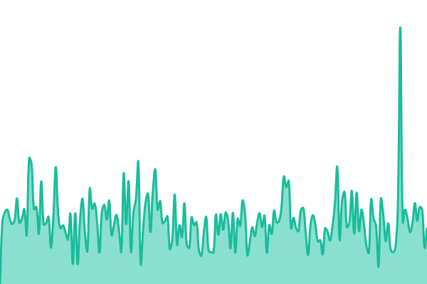
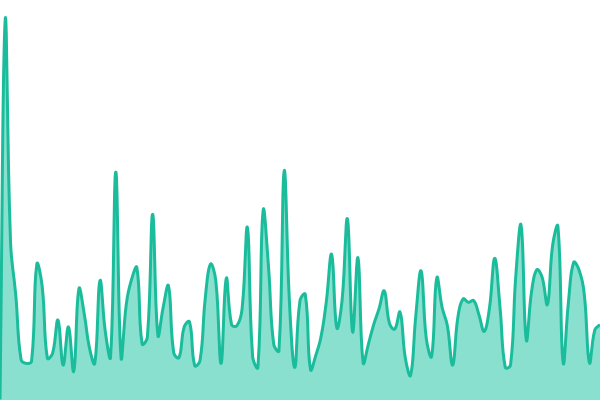

# Deadpan Status

Public service status and uptime monitoring for Deadpan apps, powered by
[Upptime](https://upptime.js.org).

Status website: **https://status.deadpan.io**.

<!--start: status pages-->
<!-- This summary is generated by Upptime (https://github.com/upptime/upptime) -->
<!-- Do not edit this manually, your changes will be overwritten -->
<!-- prettier-ignore -->
| URL | Status | History | Response Time | Uptime |
| --- | ------ | ------- | ------------- | ------ |
|  [Leaf - KOSync](https://kosync.deadpan.io/healthcheck) | 🟩 Up | [leaf-kosync.yml](https://github.com/timbueno/deadpan-status/commits/HEAD/history/leaf-kosync.yml) | 

 341ms
     
 | 

<a href="https://status.deadpan.io/history/leaf-kosync">99.64%</a>
    

|  [Leaf - API](https://api.deadpan.io/leaf/health) | 🟩 Up | [leaf-api.yml](https://github.com/timbueno/deadpan-status/commits/HEAD/history/leaf-api.yml) | 

 159ms
     
 | 

<a href="https://status.deadpan.io/history/leaf-api">100.00%</a>
    

<!--end: status pages-->

## What we monitor

- **Leaf - KOSync:** public synchronization-server health.
- **Leaf - API:** public API health.

Checks require HTTP 200 and the expected health-response content. They measure
endpoint availability, not every app feature or downstream dependency. The
five-minute schedule is approximate: GitHub Actions can delay or skip runs.

Incidents are tracked in this repository's [Issues](https://github.com/timbueno/deadpan-status/issues).
Only publish information intended for app users in incident updates.

## Configuration

Edit [`.upptimerc.yml`](.upptimerc.yml). Use `<App> - <Service>` display names and
stable slugs such as `leaf-kosync`; keep the slug when renaming a service to
preserve its history. Services may use different domains and hosting providers.
ScanBoy can be added when its public health endpoint is selected.

Upptime generates the workflows, history, API data and graphs. Make workflow
changes through `.upptimerc.yml` so template updates preserve them. Demo service
history is removed; Deadpan uptime starts with its own first successful checks.

See [SETUP.md](SETUP.md) for credentials, workflow validation, and GitHub Pages
configuration. This public repository contains only public service information.
